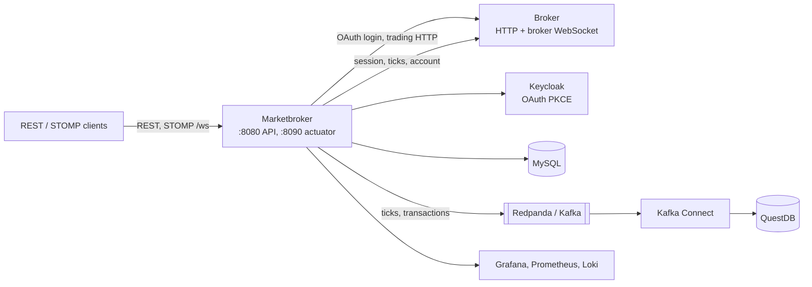
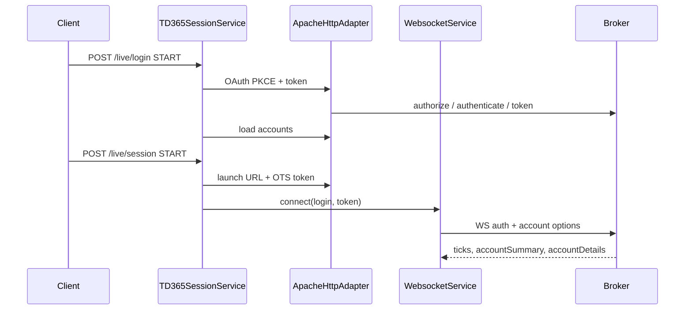
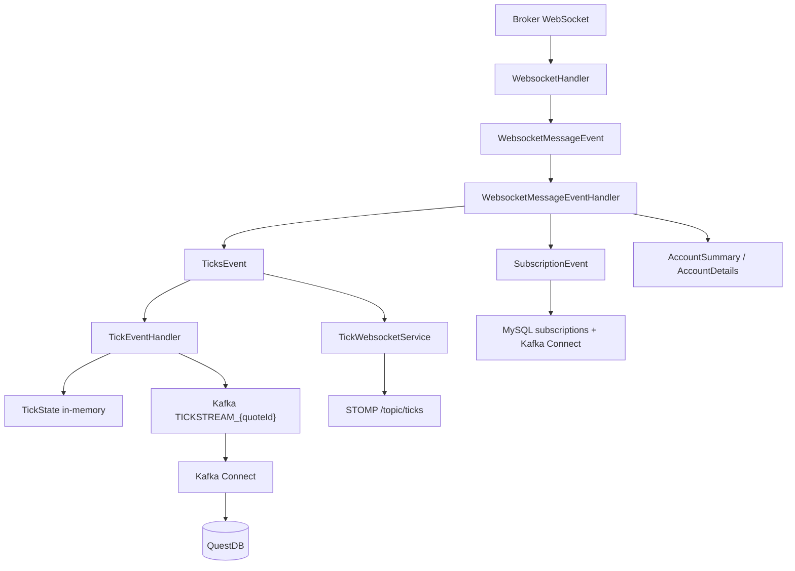

## Introduction

Marketbroker is a Spring Boot 3 / Kotlin 21 service that sits between clients and broker trading platform.

README.md contains two sections:

I. Build & Deploy / App config

II. Application architecture


Section II covers the following aspects of the application:

1. System diagram — Marketbroker between clients and TradeNation, with MySQL, Kafka, QuestDB, and observability
2. Package layout — ports-and-adapters (infrastructure → application → domain) so you can find the right class quickly
3. Session flow — OAuth login → account → WebSocket session → instrument catalogue → subscriptions
4. Tick pipeline — broker WS → Spring events → in-memory TickState, Kafka/QuestDB, and STOMP /topic/ticks
5. Orders — orderMode mapping to broker RPCs, plus how fills/closes are inferred from accountDetails diffs
6. REST API table — live, instruments, account, orders, Kafka test endpoints
7. STOMP, Kafka topics, Docker profiles

The OpenAPI spec in application/src/main/resources/marketbroker.yaml remains the detailed contract; the README is the navigation layer for how those endpoints actually run.


# I. Build & deploy

### Docker build

```bash
docker build -f ./Dockerfile -t docker_repo_url/marketbroker:0.4.0 .
```

### Run

```bash
docker compose --profile infra up
```


### Refresh image of running container

```bash
docker-compose --profile sdk stop marketbroker && docker-compose --profile sdk up -d --no-deps marketbroker
```

```bash
docker compose --profile sdk stop marketbroker
docker compose --profile sdk rm -f marketbroker
docker compose --profile sdk up -d marketbroker
```

### STOMP Websocket server

Test: https://localhost:8080/
Select /topic/1


## Other services

### MySQL

### QuestDb

Materialized views:
- https://questdb.com/blog/how-to-create-a-materialized-view/

### Kafka

### kafka console/UI

### kafka-connect

Run:

```bash
./docker/kafka_connect.sh
```


### Grafana

- Data source plugins:

https://grafana.com/grafana/plugins/questdb-questdb-datasource/?tab=installation

```bash
grafana-cli plugins install questdb-questdb-datasource
```

- Dashboards:
JVM SpringBoot3 dashboard (for Prometheus Operator) ID: 22108


### Loki

### Prometheus


# Login flow

OAuth PKCE implemented:

- Authorize — GET authurl/oauth/authorize with PKCE (code_challenge, state, client_id, etc.)
- Keycloak login — parse the login form from the HTML and POST username / password to login-actions/authenticate
- Authorization code — read code from the redirect chain to tradenation.com/login/callback
- Token exchange — POST to authurl/oauth/token with grant_type=authorization_code and code_verifier

## App Configuration

resources/*.properties


# II. Architecture

Marketbroker is a Spring Boot 3 / Kotlin 21 service that sits between clients and broker trading platform. It authenticates to the broker, keeps a live trading session, forwards orders, and fans market ticks out to Kafka, QuestDB, and STOMP clients.



## Code layout

The `application` module follows a ports-and-adapters split under `com.piotr.marketbroker`:

| Package | Role |
|---|---|
| `infrastructure/rest/controller` | REST adapters. Controllers implement OpenAPI-generated interfaces (`OrdersApi`, `LiveApi`, …). Spec: `application/src/main/resources/marketbroker.yaml`. |
| `application/service` | Use cases: session, orders, subscriptions, market groups/quotes. |
| `application/handler` | React to broker account-state changes (fills, pending-order execution, position close) and publish Kafka transaction events. |
| `application/websocket` | Outbound client to the broker WebSocket; parses broker messages into Spring events. |
| `domain` | Entities, ports (`*Repository`, `TickState`, `KafkaConnectPort`), and domain events. |
| `infrastructure/persistence` | JPA/MySQL adapters plus in-memory `TickState`. |
| `infrastructure/http` | Cookie-aware Apache HttpClient used for OAuth, session HTTP, and trading RPCs. |
| `infrastructure/kafkaconnect`, `infrastructure/questdb` | Per-quote QuestDB tables and sink connectors. |
| `infrastructure/websocket` | Broker WS client (`WebsocketHandler`) and inbound STOMP broker (`/ws`). |
| `configuration` | Security, Kafka topics, STOMP, tracing, OpenAPI. |

Request path: **controller → application service / handler → domain port → infrastructure adapter**. Broker traffic does not go through Feign; `ApacheHttpAdapter` and `WebsocketHandler` are the live clients.

## How a session works

Typical startup sequence after the process is up:

1. `POST /live/login` with `state=START` — `TD365SessionService` runs OAuth PKCE against Keycloak, stores the JWT, then loads trading accounts.
2. `GET /live/accounts` — list demo/live accounts (balance, `ct_login_id`, …).
3. `POST /live/session` with `state=START` and `accountId` — resolve the launch URL, extract the OTS session token, connect the broker WebSocket, authenticate, and subscribe to account summary/details.
4. `POST /instruments/groups` then `POST /instruments/quotes` — pull the instrument catalogue from broker into MySQL.
5. `POST /instruments/subscriptions` — subscribe to quoteIds on the broker WebSocket.

Keepalive: scheduled `UpdateClientSessionID` HTTP calls, JWT refresh, and WebSocket reconnect (up to 3 attempts) that re-subscribes quotes. `STOP` on session then login tears the session down and publishes `SessionClosedEvent` (clears in-memory account state, subscriptions, Kafka Connect sinks).



## Tick and market-data path

Incoming broker WebSocket frames become `WebsocketMessageEvent`. `WebsocketMessageEventHandler` demultiplexes them:

| Broker message `t` | Result |
|---|---|
| `heartbeat` | Echo heartbeat back to broker |
| `p` | `TicksEvent` (bid/ask per quoteId) |
| `subscribeResponse` / `unsubscribeResponse` | `SubscriptionEvent` |
| `accountSummary` | in-memory snapshot for `GET /account/summary` |
| `accountDetails` | positions + opening orders; diffs drive fill/close events |

`TicksEvent` is then handled in two places:

- `TickEventHandler` — latest tick per quoteId into in-memory `TickState` (used when creating orders); publish `TickStreamEvent` to Kafka topic `TICKSTREAM_{quoteId}_TOPIC`.
- `TickWebsocketService` — STOMP publish to `/topic/ticks` and `/topic/{symbolId}` for mapped quoteIds.

On a successful subscribe, `SubscriptionEventHandler` persists the subscription in MySQL, creates QuestDB table `TICKSTREAM_{quoteId}`, and upserts a Kafka Connect QuestDB sink.



## Orders and account state

`POST /orders` maps `orderMode` to a broker HTTP RPC, using the last tick from `TickState` for the quote:

| `orderMode` | Action | Broker call |
|---|---|---|
| `0` | Market order (optional SL/TP) | `RequestTrade` |
| `1` | Limit opening order | `InsertOpenOrder` |
| `2` | Stop opening order | `InsertOpenOrder` |
| `4` | Close full position by `positionId` | `InsertClosePosition` |
| `5` | Close full position by `orderId` | `InsertClosePosition` |

Orders are stored in MySQL. Lifecycle changes also go to Kafka `TRANSACTIONS_TOPIC` (`PENDING`, `FILLED`, `CLOSED`, `CANCELLED`).

Live positions and pending orders are **not** polled over HTTP. They arrive on the broker WebSocket as `accountDetails`. `AccountDetailsHandler` diffs snapshots and emits:

- `MarketOrderExecutedEvent` — market order matched to a new position
- `OpeningOrderExecutedEvent` — pending order disappeared and a matching position appeared
- `PositionClosedEvent` — position gone; close price resolved from `GetTransactionHistory`

`GET /account/positions` and `GET /account/opening-orders` read that in-memory snapshot. `GET /account/summary` reads the latest `accountSummary` frame.

## REST API

OpenAPI spec is the source of truth (`marketbroker.yaml`). Springdoc serves Swagger UI from the app. Controllers require `ROLE_manager` when security is enabled (`com.piotr.marketbroker.security.enabled`); default config has security **off**.

| Method | Path | Purpose |
|---|---|---|
| `POST` | `/live/login` | `START` / `STOP` broker OAuth login |
| `GET` | `/live/accounts` | Trading accounts after login |
| `POST` | `/live/session` | `START` / `STOP` broker HTTP+WS session |
| `GET` | `/config` | Dump broker configuration (internal) |
| `GET`/`POST` | `/instruments/groups` | Read / refresh market groups |
| `GET`/`POST` | `/instruments/quotes` | Read / refresh quotes (needs groups first) |
| `GET` | `/instruments/ticks` | Last tick per subscribed quote (`TickState`) |
| `GET`/`POST` | `/instruments/subscriptions` | List or subscribe/unsubscribe quoteIds |
| `GET` | `/account/summary` | Live account summary from WS |
| `GET` | `/account/positions` | Open positions from WS |
| `GET` | `/account/opening-orders` | Pending orders from WS |
| `POST`/`GET` | `/orders` | Create / list orders |
| `GET`/`DELETE` | `/orders/{id}` | Get or cancel a pending order (`PATCH` amend is not implemented) |
| `GET` | `/orders/history` | Broker transaction history |
| `POST` | `/publish-json`, `/publish-text` | Test publishes to Kafka |
| `GET` | `/hello` | Smoke test |

Actuator (port **8090**): `/health`, `/info`, `/prometheus`, `/startup`.

## Client WebSocket (STOMP)

Inbound STOMP endpoint: `GET /ws` (SockJS). Simple broker destinations: `/topic/*`. Application prefix: `/app`.

- Ticks: subscribe to `/topic/ticks` or `/topic/{symbolId}` (see mapping in `TickWebsocketService`).
- Chat-style demo: `/app/addUser`, `/app/sendMessage` → `/topic/public`.

## Data stores and Kafka

**MySQL** holds orders, subscriptions, market groups, and quotes (JPA `ddl-auto: update`).

**Kafka topics** (see `KafkaTopics`): per-instrument `TICKSTREAM_{quoteId}_TOPIC`, `TRANSACTIONS_TOPIC`, plus `JSON_DATA_TOPIC` / `TEXT_DATA_TOPIC` for test publishes. Kafka Connect sinks ticks into QuestDB tables `TICKSTREAM_{quoteId}`.

## Docker profiles

| Profile | What it starts |
|---|---|
| `infra` | Redpanda, Kafka Connect, MySQL, QuestDB, Grafana, Prometheus, Loki, Tempo |
| `sdk` | `infra` plus the `marketbroker` app (`:8080`, `:8090`) |
| `questdb` / `lab` | QuestDB (and Jupyter in `lab`) without the full stack |
